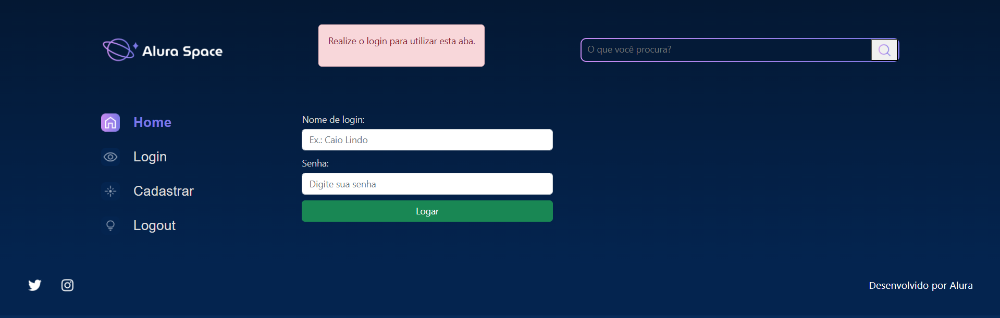
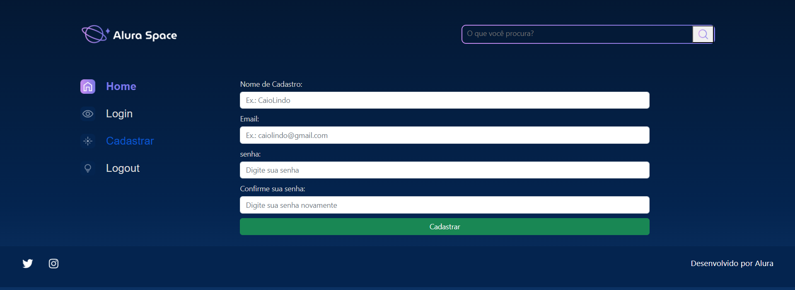
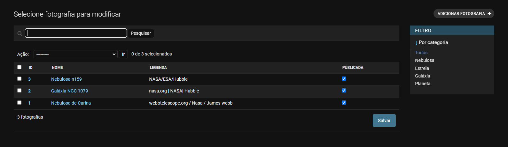

<h1>Projeto Alura Space | Django </h1>

>projeto em desenvolvimento

<h2> Imagens do projeto:</h2>
<p>Home:</p>


<p>Aba galeria:</p>


<p>Aba login:</p>



<p>Aba Cadastro:</p>



<p>Tela admin:</p>



```
Obs.: Recomendo que utilize um ambiente virtual em sua máquina para instalar as extensões presentes no requirements.txt.
```